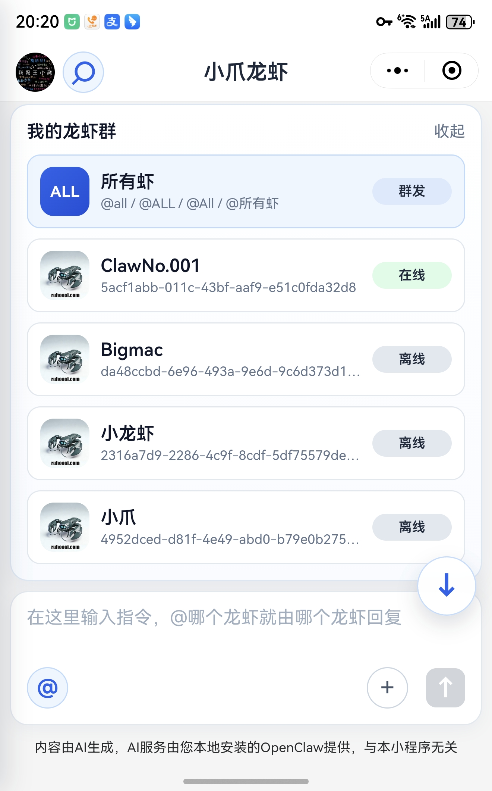
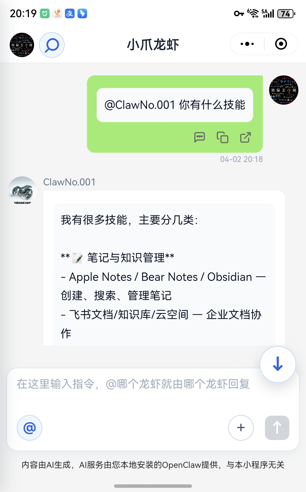
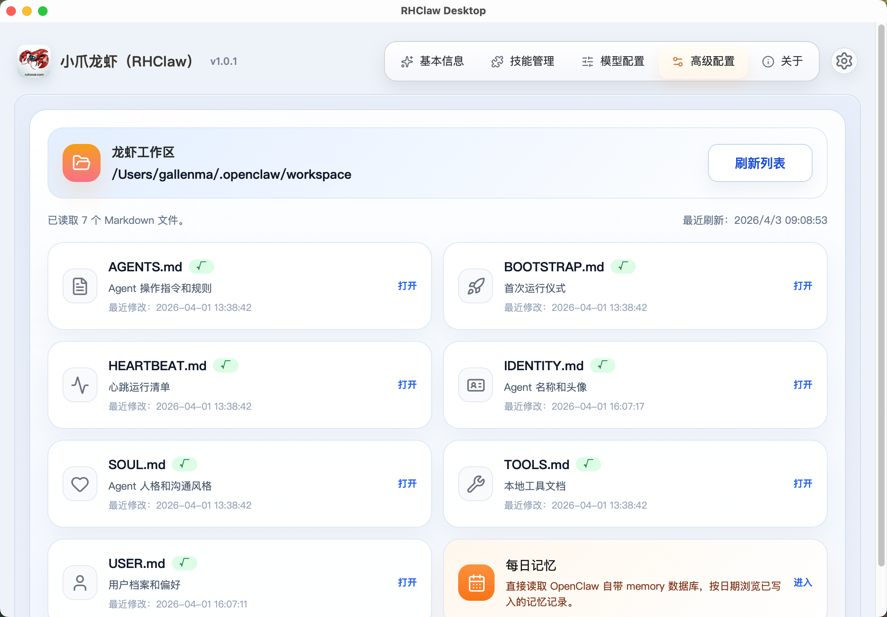

<div align="center">


# RHClaw

### Your Private AI Lobster Army 🦐🦐

[](https://github.com/papachong/RHClaw/actions)
[](https://github.com/papachong/RHClaw/releases)
[](LICENSE)
[](https://rhclaw.ruhooai.com)
[](https://rhclaw.ruhooai.com)

**One-click setup with fully automated local installation and configuration for the official OpenClaw, seamlessly connected to the WeChat Mini Program. Secure and reliable, multi-lobster collaboration, shared brains — start your private lobster army journey today!**

[Download Desktop](https://rhclaw.ruhooai.com) · [Quick Start](#quick-start) · [中文](README.zh-CN.md)

</div>

---

## Project Modules Brief

- `RHClaw-Desktop/`: Desktop client for packaging, installing, configuring, and managing the OpenClaw multi-platform offline bundle. Built with Tauri + React.
- `RHClaw-Channel/`: An OpenClaw Gateway channel plugin that bridges the RHClaw control-plane protocol into the OpenClaw runtime.
- `RHClaw-Server/`: RHClaw backend service. It connects to OpenClaw through RHClaw-Channel and handles message routing, model configuration delivery, device binding, subscriptions, and order management. This module is source-available on request rather than fully open-sourced due to security considerations.
- `RHClaw-IM/`: WeChat Mini Program IM client for directing your lobsters in daily use. This module is source-available on request.
- `RHClaw-Admin/`: RHClaw administration console built on top of the server backend for operational management. This module is source-available on request.

## Solution Documents

- [RHClaw Overall Solution](assets/docs/RHClaw整体解决方案.md)
- [RHClaw Desktop One-Click Installation Plan](assets/docs/RHClaw-Desktop一键安装技术方案.md)
- [RHClaw Channel Open Source Execution Plan](assets/docs/RHClaw-Channel开源执行计划.md)

## Product Screenshots

<div align="center">
	<table>
		<tr>
			<td align="center">
				
				<br />
				Mini program group list
			</td>
			<td align="center">
				
				<br />
				Mini program chat
			</td>
		</tr>
		<tr>
			<td colspan="2" align="center">
				
				<br />
				Desktop workspace
			</td>
		</tr>
	</table>
</div>

## Quick Start

```bash
cd RHClaw-Desktop
cp .env.example .env.local
npm install
npm run desktop:dev
```

By default, the workspace assumes a local API service at `http://localhost:3000/api/v1`. If your API runs elsewhere, update `.env.local` before starting Vite.

## Desktop And Channel

`RHClaw-Desktop/` and `RHClaw-Channel/` are designed to work together in the same public workspace.

- Desktop can consume a local Channel source checkout through `RHOPENCLAW_CHANNEL_ROOT`.
- Desktop full-offline packaging can also consume a prebuilt Channel `.tgz` through `RHOPENCLAW_CHANNEL_PACKAGE_PATH`.
- The current npm package spec remains `@rhopenclaw/rhclaw-channel` for compatibility with the existing Desktop installer, local validation logic, and full-offline packaging flow.
- If the package scope is rebranded later, the Desktop frontend, Tauri runtime checks, Rust-side install receipts, and packaging scripts must be updated together in one coordinated change — modifying only the Channel metadata is not sufficient.

## GitHub Actions Build And Release (Desktop)

This repository includes a desktop CI workflow at `.github/workflows/desktop-package.yml`.

- Manual trigger: run `RHClaw Desktop Package` from GitHub Actions (`workflow_dispatch`).
- Tag trigger: push tags like `v1.0.0` or `desktop-v1.0.0` to start build + release flow.
- Build targets: macOS arm64, macOS x64, Windows x64.
- Build artifacts: uploaded as workflow artifacts (`rhclaw-desktop-*-bundle`).
- Release report: uploaded as `rhclaw-desktop-release-report`.
- GitHub Release publish:
	- Automatic for tag pushes.
	- Optional for manual runs via `publish_github_release=true`.

Recommended repository secrets:

- `RHCLAW_DESKTOP_UPDATER_PRIVATE_KEY`
- `RHCLAW_DESKTOP_UPDATER_PRIVATE_KEY_PASSWORD`
- `RHOPENCLAW_RELEASE_MANIFEST_PRIVATE_KEY` (optional, enables manifest signing)
- `RHOPENCLAW_RELEASE_MANIFEST_PUBLIC_KEY` (optional, enables manifest signing)
