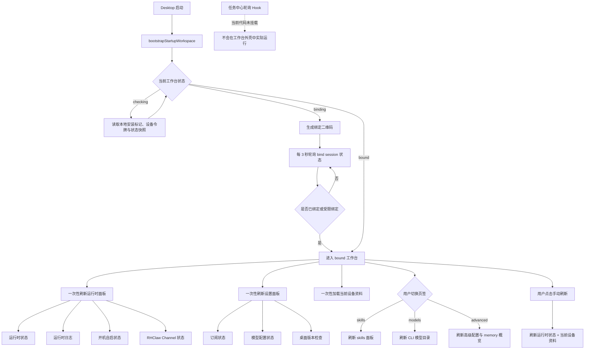
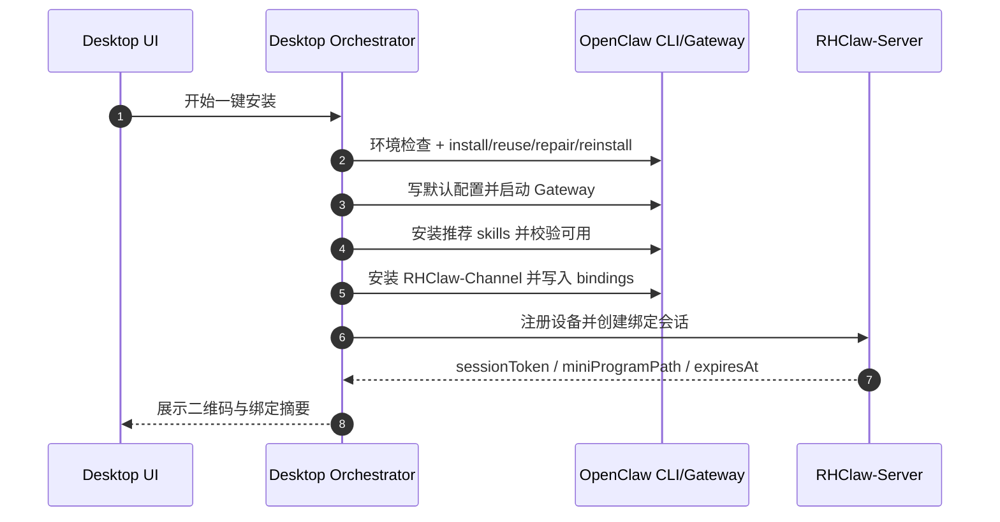
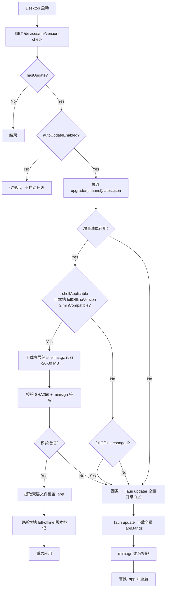

# RHClaw-Desktop 一键安装技术方案

## 一、方案定位

`RHClaw-Desktop` 的最终定位是：

1. `OpenClaw` 官方运行时的一键安装与配置工具。
2. `RHClaw-Channel` 插件的安装与配置入口。
3. 扫码绑定、订阅管理、模型配置与运行状态查看入口。
4. 不参与 `IM ↔ Server ↔ Channel ↔ OpenClaw` 的运行时消息转发链路。

本方案只保留已选定的实现路径，统一遵循以下原则：

1. 不修改、不注入、不覆盖 OpenClaw 官方二进制与资源。
2. 安装、修复、升级优先调用 OpenClaw 官方 CLI 能力，不自造私有安装协议。
3. Desktop 与 OpenClaw 版本解耦；Desktop 自身升级与 OpenClaw Runtime 升级独立处理。
4. 面向国内交付时，安装脚本、离线包和镜像资产只使用国内源，不向终端用户暴露海外依赖地址。
5. 默认支持 `macOS` 与 `Windows x64`，对外安装包统一使用 `RHClaw-Desktop-{version}-{platform}-{arch}.{ext}` 命名。

## 二、总体架构

最终采用四层结构：

1. `Desktop Shell`
   - 基于 Tauri 提供安装向导、二维码绑定、设置面板、日志与运行状态展示。

2. `Installer Orchestrator`
   - 负责环境检查、调用官方 `openclaw` CLI、执行安装/修复/复用/重装、安装插件与 skills、生成安装结果。

3. `OpenClaw Runtime`
   - 使用官方 `Gateway + Channel Runtime + plugins` 体系运行。
   - Gateway 由系统守护方式托管，Desktop 退出后仍持续运行。

4. `Server / Admin Control Plane`
   - `RHClaw-Server` 负责设备、绑定、订阅与公共配置下发。
   - `RHClaw-admin` 负责运营配置维护，不承担用户侧 skills 的持续编排。

职责边界：

1. `RHClaw-Desktop` 负责安装、配置、展示与编排。
2. `OpenClaw Gateway` 负责官方运行时与插件宿主。
3. `RHClaw-Channel` 负责与 `RHClaw-Server` 的业务通信。
4. Desktop 不承担消息桥接职责。

### 2.1 Desktop 工作台刷新链路

Desktop 工作台的刷新策略统一采用“进入态一次性刷新 + 局部页面按需刷新 + 绑定阶段短轮询”的方式，不设计常驻全局轮询任务。



补充说明：

1. 绑定阶段存在唯一常驻短轮询：绑定会话状态查询，周期为 `3s`，仅在 `binding` 态运行。
2. 进入 `bound` 工作台后，不存在“每 N 秒全局刷新一次首页”的常驻定时任务。
3. 运行时面板与设置面板的自动刷新，都是在进入 `bound` 或设备进入 `connected` 后触发的一次性批量刷新。
4. `skills`、`models`、`advanced` 三个页签采用按需刷新，只有切换进入对应页签时才触发数据加载。
5. 当前代码中虽然保留了 `TaskCenter` 的 `1.5s` 轮询能力，但尚未挂载到 `App` 或工作台页面，因此不属于现网 Desktop 工作台外壳的实际刷新链路。
6. 安装向导中的任务状态查询属于安装流程内部轮询，不计入工作台常驻刷新策略。

## 三、发布与交付

### 3.1 安装包形态

1. `macOS arm64`：`dmg`
2. `macOS x64`：`dmg`
3. `Windows x64`：`exe`（官网固定下载地址） + `msi`（版本归档与兼容安装）

对外命名统一为：

```text
RHClaw-Desktop-{version}-{platform}-{arch}.{ext}
```

示例：

1. `RHClaw-Desktop-0.1.0-macos-arm64.dmg`
2. `RHClaw-Desktop-0.1.0-macos-x64.dmg`
3. `RHClaw-Desktop-0.1.0-windows-x64.exe`
4. `RHClaw-Desktop-0.1.0-windows-x64.msi`

### 3.2 发布流水线

发布链路统一为：

```text
检查 OpenClaw / Node / skills 版本与离线资产差异
-> 仅在 full-offline 输入物料过期时重建当前平台物料
-> 校验 full-offline-only/{platform} manifest 与文件完整性
-> tauri:doctor
-> tauri:build
-> release:bundle-extras
-> release:normalize
-> release:manifest
-> release:verify
```

约束如下：

1. 打包前必须先检查 `OpenClaw`、当前平台 `Node.js`、推荐 `skills` 与现有离线资产 manifest 的版本差异。
2. 若版本未变化，则复用已有离线资产，不重复下载；仅对版本变化项执行增量更新。
3. 当前平台打包必须以 `full-offline-only/{platform}/manifests/full-offline-materials.json` 作为唯一输入基线；如需单独准备 OSS 镜像目录，使用 `npm run openclaw:prepare-mirror-assets`。
4. 推荐 `skills` 的版本检查应基于服务端推荐列表、SkillHub 在线索引与本地已安装状态；版本未变化时不重复执行在线安装。
5. `release:normalize` 负责将原始 Tauri 产物重命名为统一对外文件名。
6. `release:manifest` 与 `release:verify` 必须在重命名后执行。
7. 正式发布必须带签名版 `release-manifest.json`，并通过门禁校验。
8. 单平台包装脚本可先执行到 `release:verify`；只有在 `macOS arm64 / macOS x64 / Windows x64` 产物齐全后，才执行最终 `release:gate`。
9. 双平台实机升级与回滚证据单独归档到发布与演练文档，不在本方案中展开。
10. 任何需要访问外网的构建步骤，只允许在内部打包机或 CI 阶段通过代理执行，不允许把代理配置、海外源地址或临时下载脚本带入最终交付物。

### 3.2.1 多机分平台统一发布入口

当前发布不再要求每台机器直接手工执行底层打包命令 + `publish-to-oss.sh`。统一采用仓库根目录入口脚本：

1. 共享主入口：`scripts/package-and-publish-desktop.mjs`
2. Windows 薄封装：`scripts/package-and-publish-desktop.ps1`
3. macOS 薄封装：`scripts/package-and-publish-desktop.sh`

设计目标：

1. Windows 机器只负责 `windows-x64`。
2. macOS Intel 机器只负责 `macos-x64`。
3. macOS Apple Silicon 机器只负责 `macos-arm64`。
4. 入口脚本根据当前机器自动识别目标平台，禁止跨机误发其他平台产物。
5. 发布时自动合并远端 `rhclaw-desktop/updater/{channel}/latest.json`，避免最后一台机器覆盖掉前面已发布的平台条目。
6. 默认只上传当前平台安装包、版本级 `release-manifest.json`、官网 `latest/` 别名与目标专属元数据。
7. 默认不覆盖 `release-json/*` 与 `mirrors/*`，避免多机并行发布时互相踩写；只有固定发布节点才显式追加公共元数据上传。
8. 打包阶段自动注入 `RHClaw_RELEASE_BASE_URL=https://files.ruhooai.com/rhclaw-desktop/releases/{version}`，确保本地生成的 updater 清单带正确下载地址。

推荐执行方式：

```powershell
$env:OSS_BUCKET='your-bucket'
.\scripts\package-and-publish-desktop.ps1
```

```bash
export OSS_BUCKET='your-bucket'
bash ./scripts/package-and-publish-desktop.sh
```

常用调试参数：

1. `--skip-package`：跳过打包，仅发布当前 `release/` 目录已有产物。
2. `--dry-run`：只打印将执行的命令与 OSS 上传路径。
3. `RHClaw_FORCE_REBUILD_OFFLINE=1`：强制重建当前平台 `full-offline-only/{platform}` 输入物料后再打包。
4. `--publish-server-meta`：显式上传 `release-json/release-manifest.json` 与 `release-json/compatibility-matrix.json`。
5. `--publish-mirrors`：显式上传 `release/openclaw-bootstrap/mirror-assets` 对应镜像目录。

建议约束：

1. 三台机器都使用统一入口，不再各自拼装上传命令。
2. `--publish-server-meta` 与 `--publish-mirrors` 只允许一个固定发布节点执行一次。
3. 若仅验证路径，不应直连 OSS，统一使用 `--skip-package --dry-run`。

推荐命令序列（示例）：

```bash
export https_proxy=http://127.0.0.1:7890
export http_proxy=http://127.0.0.1:7890
export all_proxy=socks5://127.0.0.1:7890

# 如需单独准备 OSS 镜像目录
npm run openclaw:prepare-mirror-assets -- --openclaw-version=latest --node-version=22.14.0
npm run tauri:doctor
npm run tauri:build
npm run release:bundle-extras
npm run release:normalize
npm run release:manifest
npm run release:verify
```

### 3.3 最终交付给用户的 Desktop 安装包内容

最终交付给用户的 `RHClaw-Desktop` 安装包，推荐内置“当前平台可独立完成 OpenClaw Runtime 与 Channel 主体安装”的最小离线资产，不直接内置整套 OSS 镜像目录。

推荐包含：

- Desktop 应用本体。
- 当前平台的离线安装脚本：`release/openclaw-bootstrap/full-offline-only/{platform}/openclaw/install-cn.sh`、`release/openclaw-bootstrap/full-offline-only/{platform}/openclaw/install.sh`
- 当前版本的 OpenClaw npm 离线包：`release/openclaw-bootstrap/full-offline-only/{platform}/packages/openclaw/openclaw-{version}-with-deps.tgz`
- 当前平台的 Node.js 离线包：`release/openclaw-bootstrap/full-offline-only/{platform}/packages/node/node-v{nodeVersion}-{platform}-{arch}.tar.gz`
- 当前版本的 RHClaw-Channel 插件离线包：`release/openclaw-bootstrap/full-offline-only/{platform}/packages/rhclaw-channel/RHClaw-rhclaw-channel-{version}.tgz`
- 当前离线包 manifest：`release/openclaw-bootstrap/full-offline-only/{platform}/manifests/full-offline-materials.json`

推荐不包含：

1. `release/openclaw-bootstrap/mirror-assets` 全量目录。
2. 非当前平台的 Node.js 离线包。
3. `skills/**/*`、`skills-bundle`、`skills lockfile` 等 skills 安装包资产。
4. 面向 OSS/CDN 发布的中间镜像文件。
5. 构建阶段才需要的外部源地址与调试辅助文件。

原因如下：

1. Desktop 安装包只需要保证当前平台在弱网或离线条件下可完成 OpenClaw Runtime 与 Channel 主体安装。
2. OSS 镜像目录用于在线回退与远程分发，不应重复塞入每个平台安装包。
3. Skills 改为通过 SkillHub 在线安装，不再随 Desktop 安装包分发独立技能包，因此推荐 skills 的补齐与校验需要联网到 SkillHub。
4. 保持安装包体积可控，避免把非当前平台资产一起交付给终端用户。

### 3.4 离线包版本与一致性门禁

每次发布必须满足以下一致性要求：

1. `full-offline-only/{platform}/manifests/full-offline-materials.json` 的 `openclawVersion` 必须等于本次 `latest` 解析结果。
2. `full-offline-only/{platform}/packages/openclaw/` 目录中必须存在且只存在与该 `openclawVersion` 对应的 `-with-deps.tgz`。
3. `full-offline-only/{platform}/packages/node/` 目录中必须存在当前目标平台所需的 Node.js 离线包。
4. 安装包内置的离线目录只允许引用 `files.ruhooai.com` 与本地路径，不得出现海外源地址。
5. `RHClaw-Desktop` 运行时必须只使用安装包内置 `full-offline-only/{platform}`，镜像目录仅作为独立 OSS 在线回退源。
6. `skills` 的推荐列表与在线安装结果必须可追溯；若 `slug + version` 未变化，则不得重复执行安装。
7. 若离线资产复用历史文件，则复用前仍必须校验 manifest、文件存在性和 `sha256` 一致性。

## 四、安装主链路

### 4.1 最终安装路径

Desktop 安装 OpenClaw 统一使用官方 CLI，核心入口是：

```bash
openclaw onboard \
  --non-interactive \
  --json \
  --mode local \
  --gateway-bind loopback \
  --gateway-port 18789 \
  --gateway-auth token \
  --gateway-token-ref-env OPENCLAW_GATEWAY_TOKEN \
  --install-daemon \
  --daemon-runtime node \
  --accept-risk
```

说明：

1. 默认运行模式为本机 `Gateway` 托管。
2. Gateway 默认只监听本机回环地址。
3. Gateway 默认使用 token 鉴权。
4. 安装结果统一用 `--json` 输出，由 Desktop 解析并回填状态。
5. Skills 不采用服务端三态编排，安装阶段直接预装推荐 skills 并验证可用。

### 4.2 一键安装闭环

安装成功页的定义是：

1. OpenClaw CLI 与 Gateway 已可用。
2. `RHClaw-Channel` 已安装并完成默认配置。
3. Desktop 已完成设备预注册。
4. Desktop 已拿到绑定会话并生成二维码。

最终后台顺序固定为：

1. 检查安装环境。
2. 执行复用、修复或重装。
3. 写入默认模型与 Gateway 配置。
4. 启动并验证 Gateway。
5. 安装推荐 skills 并验证可用。
6. 安装并启用 `RHClaw-Channel`。
7. 注册设备并创建绑定会话。
8. 展示微信二维码。

时序如下：



### 4.3 写入默认模型与 Gateway 配置策略

安装步骤 3「写入默认模型与 Gateway 配置」的核心逻辑由 `write_gateway_llm_config` 函数实现，需区分 **原生 Provider** 与 **OpenAI 兼容 Provider** 两种路径。

#### 4.3.1 原生 Provider 与兼容 Provider 判定

OpenClaw Gateway 内置 22 个原生 Provider（v2026.3.11 基线）：

| 分类 | Provider 前缀 |
|------|---------------|
| 国内厂商 | `zai`、`minimax`、`minimax-cn`、`kimi-coding` |
| 国际厂商 | `anthropic`、`google`、`xai`、`mistral`、`openrouter` |
| Google 系列 | `google-antigravity`、`google-gemini-cli`、`google-vertex` |
| 云平台 | `amazon-bedrock`、`azure-openai-responses`、`vercel-ai-gateway` |
| 开源/聚合 | `groq`、`cerebras`、`huggingface`、`github-copilot`、`opencode`、`opencode-go`、`openai-codex` |

判定函数 `has_native_openclaw_driver(prefix)` 返回 `true` 时，表示该 Provider 在 Gateway 中有原生驱动，**不需要** `api: "openai-completions"` 适配器。

凡不在上表中的 Provider 前缀（包括 `openai`），均视为 **OpenAI 兼容模式**，需要写入 `api: "openai-completions"` 适配器。

> 服务端 `provider-catalog.ts` 中 `deepseek`、`kimi`（moonshot）、`dashscope`（阿里云百炼）等映射到 `openclawPrefix: "openai"`，因此走兼容路径。

#### 4.3.2 配置写入规则

根据 Provider 类型，`write_gateway_llm_config` 按以下规则写入 `~/.openclaw/openclaw.json`：

**原生 Provider（如 `zai`/`anthropic`/`google` 等）**

```json
{
  "models": {
    "mode": "merge",
    "providers": {
      "zai": {
        "apiKey": "<API_KEY>",
        "baseUrl": "https://open.bigmodel.cn/api/paas/v4",
        "models": [
          { "id": "glm-4-flash", "name": "glm-4-flash" }
        ]
      }
    }
  }
}
```

- 不写入 `api` 字段，由 Gateway 原生驱动自动处理。
- 若检测到遗留的 `api: "openai-completions"` 字段，主动删除。
- 参考：[智谱 OpenClaw 配置文档](https://docs.bigmodel.cn/cn/coding-plan/tool/openclaw)。

**兼容 Provider（如 `openai` 前缀的 deepseek/kimi/dashscope 等）**

```json
{
  "models": {
    "mode": "merge",
    "providers": {
      "openai": {
        "api": "openai-completions",
        "apiKey": "<API_KEY>",
        "baseUrl": "https://api.deepseek.com",
        "models": [
          { "id": "deepseek-chat", "name": "deepseek-chat" }
        ]
      }
    }
  }
}
```

- 必须写入 `api: "openai-completions"` 以激活 OpenAI 兼容适配器。
- `baseUrl` 指向目标厂商的 API 端点。

#### 4.3.3 .env API Key 写入

所有 Provider 均通过 `~/.openclaw/.env` 注入 API Key，环境变量名按前缀映射：

| Provider 前缀 | 环境变量名 |
|---|---|
| `zai` | `ZAI_API_KEY` |
| `anthropic` | `ANTHROPIC_API_KEY` |
| `google` | `GEMINI_API_KEY` |
| `minimax` / `minimax-cn` | `MINIMAX_API_KEY` |
| `xai` | `XAI_API_KEY` |
| `mistral` | `MISTRAL_API_KEY` |
| `openrouter` | `OPENROUTER_API_KEY` |
| `moonshot` | `MOONSHOT_API_KEY` |
| `kimi-coding` | `KIMI_API_KEY` |
| `opencode` / `opencode-go` | `OPENCODE_API_KEY` |
| 其他（含 `openai`） | `OPENAI_API_KEY` |

仅当 `compat_prefix == "openai"` 时额外写入 `OPENAI_BASE_URL`。

#### 4.3.4 默认模型设置

写入到 `agents.defaults.model`：

```json
{ "agents": { "defaults": { "model": "zai/glm-4-flash" } } }
```

模型标识符统一为小写 `{prefix}/{model_id}` 格式。

## 五、环境检查与处理策略

### 5.1 五态模型

安装环境统一收敛为五态：

| 状态 | 含义 | 用户动作 | 后台动作 |
|---|---|---|---|
| 状态 1 | 未发现可用 `openclaw` CLI | 重新安装 | 直接进入官方安装主路径 |
| 状态 2 | 存在残缺安装，无法进入官方诊断 | 重新安装 | 直接进入官方安装主路径 |
| 状态 3 | 已安装但 Gateway 当前未运行 | 统一决策页 | 先尝试启动，再落为复用或修复 |
| 状态 4 | 已安装但状态异常，不建议直接复用 | 修复 / 重新安装 | 优先 `doctor` 修复，失败再重装 |
| 状态 5 | 已安装且状态正常，可直接复用 | 复用 / 重新安装 | 复用优先，必要时先升级 |

### 5.2 统一诊断命令

Desktop 只使用官方命令完成检查与修复编排：

1. `openclaw update status --json`
2. `openclaw health --json`
3. `openclaw gateway status --json`
4. `openclaw status --json`
5. `openclaw doctor --non-interactive`
6. `openclaw update --yes --json`
7. `openclaw reset --scope full --yes --non-interactive`
8. `openclaw onboard --non-interactive --json ...`

### 5.3 处理规则

1. 状态 1、状态 2：只允许重新安装。
2. 状态 3：自动尝试拉起 Gateway，再进入统一决策页。
3. 状态 4：允许修复或重新安装；修复失败时统一回退为重新安装。
4. 状态 5：允许复用或重新安装；若版本落后则先执行后台升级。
5. 任一修复、升级或安装链路失败，统一提示重新启动安装程序并走全新安装。

## 六、Skills 安装策略

### 6.1 最终目标

Skills 的最终管理方式不是服务端持续编排，也不需要灰度控制，而是：

1. Desktop 首次安装时，一次性安装好推荐的 skills。
2. Desktop 必须在安装完成前校验这些推荐 skills 可用。
3. 用户后续自行维护自己的 skills，包括安装、升级、删除与替换。
4. 服务端不负责用户侧 skills 的长期目标状态管理。

### 6.2 推荐预装策略

安装阶段只保留“推荐预装并校验可用”这一条路径，不再区分 `builtin / custom / off` 三种模式。

默认规则如下：

1. 首次安装时预装一组推荐 skills。
2. 若机器已存在这组推荐 skills，则只做可用性校验，不重复破坏用户已有配置。
3. 若推荐 skills 中有缺失项，则通过 SkillHub 在线自动补齐。
4. 安装完成的判定标准之一，是推荐 skills 已成功安装并可被 OpenClaw 正常识别。

### 6.3 预装 skills 的职责

预装 skills 的定位是“帮助用户完成后续自维护”，而不是替代用户长期管理。
推荐 skills 列表最终在 Server 端存储，由 Admin 维护；Desktop 只拉取推荐列表并通过 SkillHub 在线安装，不再分发 skills 安装包。

### 6.4 SkillHub 约束

最终采用腾讯 SkillHub，固定信息如下：

1. 站点：`https://skillhub.tencent.com/`
2. 安装脚本：`https://skillhub-1388575217.cos.ap-guangzhou.myqcloud.com/install/install.sh`
3. CLI 安装包存档：`https://skillhub-1388575217.cos.ap-guangzhou.myqcloud.com/install/latest.tar.gz`
4. Skills 主站下载模板：`https://lightmake.site/api/v1/download?slug={slug}`
5. Skills COS 备用下载模板：`https://skillhub-1388575217.cos.ap-guangzhou.myqcloud.com/skills/{slug}.zip`

安装方式（macOS/Linux，bash 可用）：

```bash
curl -fsSL "$SKILLHUB_INSTALLER_URL" | bash -s -- --no-skills
```

#### 6.4.1 SkillHub CLI 在 Windows 上的安装策略

SkillHub CLI 的 `latest.tar.gz` 内部结构为纯 Python 脚本（`skills_store_cli.py`、`skills_upgrade.py`），没有预编译二进制。官方安装器 `install.sh` 为 bash 脚本，要求 `python3` 和 `bash`。

Windows 上的一键安装采用"三级降级"策略，全链路零手工干预：

| 优先级 | 条件 | 安装方式 |
|--------|------|----------|
| 1 | 系统已有 bash（PATH 中或 Git Bash 常用路径） | 检测 Git Bash → `curl -fsSL "$URL" \| bash` |
| 2 | 无 bash，有 Windows 原生 `tar.exe`（Win10+ 内置） | Rust 下载 `latest.tar.gz` → `tar.exe` 解压 → 部署到 `~/.skillhub/` → 生成 `~/.local/bin/skillhub.cmd` wrapper |
| 3 | SkillHub CLI 部署失败或无 Python | 跳过 CLI，Rust 原生 HTTP 直接下载 skill zip 并解压到 `~/.openclaw/skills/{slug}/`，兼容 skillhub lockfile 格式 |

Git Bash 检测路径（按优先级）：

1. `where.exe bash` / `where.exe sh`
2. `C:\Program Files\Git\bin\bash.exe`
3. `C:\Program Files (x86)\Git\bin\bash.exe`
4. `C:\Git\bin\bash.exe`

Windows 原生部署（优先级 2）执行步骤：

1. `reqwest` 下载 `latest.tar.gz` 到临时目录
2. Windows 原生 `tar.exe -xzf` 解压
3. 拷贝 `skills_store_cli.py`、`skills_upgrade.py`、`version.json`、`metadata.json` 到 `%USERPROFILE%\.skillhub\`
4. 写入 `config.json`（含 `self_update_url`）
5. 生成 `%USERPROFILE%\.local\bin\skillhub.cmd`（自动检测 `python3` / `python`）
6. 部署 workspace skills（`find-skills`、`skillhub-preference`）

Rust 原生 skill 安装（优先级 3，即最终兜底）执行步骤：

1. `reqwest::blocking` 从主站或 COS 备用源下载 `{slug}.zip`
2. `zip::ZipArchive` 解压到 `~/.openclaw/skills/{slug}/`（含 zip 单目录前缀剥离、路径遍历防护）
3. 更新 `~/.openclaw/skills/.skills_store_lock.json`（SkillHub lockfile 兼容格式）

#### 6.4.2 Skills 安装执行流程

`apply_desktop_install_skills()` 的执行顺序：

```text
1. 读取推荐 skills 列表（服务端下发 / 内置默认）
2. 读取本地已安装 skills（文件系统 + openclaw skills list）
3. 计算缺失 slugs
4. 若全部已安装 → 结束
5. 尝试部署 SkillHub CLI（install_skillhub_cli_if_missing）
6. 检测 SkillHub CLI 是否可用
7. 若 CLI 可用 → 逐个 skillhub install <slug>
   若 CLI 不可用 → 逐个 install_skill_via_http()（Rust 原生下载）
8. 二次校验：重新读取已安装列表，报告仍缺失项
```

#### 6.4.3 Windows PATH 与检测路径

`detect_skillhub_cli()` 在 Windows 上按以下优先级检测：

1. `where.exe skillhub`（系统 PATH）
2. `%USERPROFILE%\.local\bin\skillhub.cmd`（原生部署位置）
3. `%USERPROFILE%\.openclaw\tooling\npm-global\skillhub.cmd`（npm-global 前缀）
4. `%APPDATA%\npm\skillhub.cmd`（npm 全局路径）

`build_skillhub_env()` 在所有平台（含 Windows）统一将 `~/.local/bin` 注入 PATH 环境变量。

#### 6.4.4 错误的 npm skillhub 包隔离

npm 注册表中存在第三方 `skillhub@0.2.11`（来源：`airano-ir/skillhub`，主页 `skills.palebluedot.live`），与腾讯 SkillHub 无关。

`is_known_incompatible_skillhub_package()` 通过读取候选路径的 `node_modules/skillhub/package.json`，检查 `homepage` 或 `repository.url` 是否匹配已知的不兼容包特征，匹配时拒绝使用该 CLI 路径。

说明：

1. SkillHub CLI 负责搜索、安装和更新 skills。
2. Desktop 在首次安装时使用 SkillHub CLI 完成推荐 skills 的预装。
3. Skills 不再随 Desktop 安装包、OSS 离线包或升级包提供独立安装资产。
4. 若安装阶段无法访问 SkillHub，则应明确提示 skills 步骤失败原因，并在网络恢复后重试在线安装。
5. 首次安装完成后，SkillHub CLI 主要服务于用户自维护，而不是服务端持续下发。

## 七、国内加速与离线资产

### 7.1 交付原则

面向国内终端用户的安装链路统一采用“镜像优先、离线优先、官方源不直出”的策略。

约束如下：

1. Desktop 安装脚本优先使用 `files.ruhooai.com` 镜像资源。
2. 离线包存在时优先从本地离线包安装。
3. 交付给用户的安装包、离线包、镜像脚本和 manifest 不包含海外源地址。
4. 海外源只允许在 CI 或内部打包阶段使用，不进入面向用户的分发资产。
5. 若构建阶段必须访问外网，统一通过以下代理基线执行：

```bash
export https_proxy=http://127.0.0.1:7890
export http_proxy=http://127.0.0.1:7890
export all_proxy=socks5://127.0.0.1:7890
```

1. 代理配置仅用于构建阶段，不写入最终安装包、离线包、镜像脚本或运行时默认环境变量。

### 7.2 当前资产形态

Desktop 已固化两套资产：

- `release/openclaw-bootstrap/full-offline-only/{platform}`：用于随 Desktop 安装包分发的当前平台 full-offline 输入物料，包含国内版 `install-cn.sh`、带依赖的 OpenClaw npm tgz、当前平台 Node.js tarball 与 RHClaw-Channel tgz。
- `release/openclaw-bootstrap/mirror-assets`：用于上传到 OSS/CDN 的镜像目录，包含 `mirrors/openclaw/*` 与 `mirrors/gum/*` 等镜像资源。

当前镜像资产的用途进一步收敛为两类：

- `full-offline-only/{platform}`：跟随 Desktop 安装包交付，用于当前平台首次离线安装。
- `mirror-assets`：上传到 OSS/CDN，用于在线镜像安装、弱网重试和安装脚本远程回退。

### 7.2.1 OSS 应上传的镜像内容

OSS 侧推荐直接上传整个 `release/openclaw-bootstrap/mirror-assets` 目录，而不是人工挑选单文件。

当前至少应包含：

1. `manifests/openclaw-mirror-manifest.json`
2. `mirrors/openclaw/install-cn.sh`
3. `mirrors/openclaw/install.sh`
4. `mirrors/openclaw/packages/openclaw-{version}.tgz`

如后续 `gum` 镜像下载成功，也应一并上传：

1. `mirrors/gum/v{gumVersion}/*`

上传规则如下：

1. OSS 目录结构需与 `mirror-assets` 本地目录保持一致。
2. `openclaw-mirror-manifest.json` 必须与镜像文件一同上传，作为镜像内容校验与运维核对基线。
3. 面向用户的安装脚本只引用 OSS 上仍然存在的镜像文件，不允许 manifest 指向已删除版本。

### 7.2.2 Desktop 安装包内置内容

Desktop 安装包只建议内置 `full-offline-only/{platform}` 中与当前平台直接相关的最小集合：

1. `openclaw/install-cn.sh`
2. `openclaw/install.sh`
3. `packages/openclaw/openclaw-{version}.tgz`
4. `packages/node/node-v{nodeVersion}-{platform}-{arch}.tar.gz`
5. `packages/rhclaw-channel/RHClaw-rhclaw-channel-{version}.tgz`
6. `manifests/full-offline-materials.json`

Desktop 安装包不内置 `mirror-assets` 全量目录，也不再内置 `skills/**/*` 推荐 skills 目录；skills 安装统一在首次安装阶段通过 SkillHub 在线完成。安装失败或离线包缺失时再回退到 OSS 镜像源。

对应脚本入口：

1. `npm run openclaw:install-cn`
2. `npm run openclaw:prepare-mirror-assets -- --openclaw-version=latest`（仅当需要单独准备 OSS 镜像目录时）

### 7.3 安装源优先级

最终安装优先级固定为：

1. `RHClaw_OFFLINE_BUNDLE_DIR` 指向的本地离线包。
2. `https://files.ruhooai.com/mirrors/openclaw/install-cn.sh`
3. `https://files.ruhooai.com/mirrors/openclaw/install.sh`

补充约束：

1. 对外交付的最终 CDN 域名固定为 `files.ruhooai.com`。
2. OSS 接入点、Bucket 原始 Endpoint 仅用于存储层配置，不进入安装脚本、manifest、客户端默认值或面向用户的交付说明。
3. 上传镜像资源时必须保持 `mirrors/openclaw/*`、`mirrors/gum/*` 等对象路径不变，确保运行时回退地址稳定。

### 7.4 环境变量注入

Desktop 执行安装时统一注入国内镜像环境变量：

1. `NPM_CONFIG_REGISTRY=https://registry.npmmirror.com`
2. `NODEJS_ORG_MIRROR=https://npmmirror.com/mirrors/node`
3. `NVM_NODEJS_ORG_MIRROR=https://npmmirror.com/mirrors/node`
4. `HOMEBREW_BREW_GIT_REMOTE=https://mirrors.tuna.tsinghua.edu.cn/git/homebrew/brew.git`
5. `HOMEBREW_CORE_GIT_REMOTE=https://mirrors.tuna.tsinghua.edu.cn/git/homebrew/homebrew-core.git`
6. `HOMEBREW_API_DOMAIN=https://mirrors.tuna.tsinghua.edu.cn/homebrew-bottles/api`
7. `HOMEBREW_BOTTLE_DOMAIN=https://mirrors.tuna.tsinghua.edu.cn/homebrew-bottles`
8. `NO_PROMPT=1`
9. `OPENCLAW_NO_ONBOARD=1`

## 八、RHClaw-Channel 集成

### 8.1 最终方案

只保留 Channel 插件方案：

1. 插件显示名：`RHClaw Channel`
2. OpenClaw `channelId`：`rhclaw`
3. npm 包名：`@ruhooai/rhclaw-channel`

Desktop 负责：

1. 安装插件。
2. 写入 `channels.rhclaw.*` 默认配置。
3. 写入 `bindings`。
4. 刷新 Gateway 并验证插件在线状态。

### 8.2 职责边界

1. `RHClaw-Channel` 负责与 `RHClaw-Server` 的控制面与数据面通信。
2. `OpenClaw Gateway` 负责插件宿主、路由和运行时生命周期。
3. Desktop 只做安装与配置，不承担业务消息转发。

## 九、绑定闭环

### 9.1 绑定流程

Desktop 安装完成后，统一执行：

1. 注册设备。
2. 创建一次性绑定会话。
3. 渲染微信二维码。
4. 等待小程序侧完成登录与绑定确认。

### 9.2 绑定与订阅解耦

最终规则如下：

1. 用户即使没有有效订阅，也允许完成设备绑定。
2. 绑定完成后，如订阅不可用，则设备归属成功，但执行权限冻结。
3. Desktop 与小程序都要引导用户在后续完成订阅或续费。
4. 未完成正式绑定且已过期的会话，由服务端回收预注册设备记录。

## 十、Desktop 自身升级

### 10.1 最终方案

Desktop 自身升级采用：

1. `tauri-plugin-updater`
2. 国内自建更新源
3. 签名校验后静默下载与安装
4. 每次启动时自动检查新版本
5. 默认自动升级，除非服务端明确关闭自动升级

更新源只允许使用 `ruhooai.com` 域名，不走 GitHub Releases 作为终端用户主更新源。

### 10.2 启动检查与自动升级机制

Desktop 每次启动后都执行一次版本检查，默认流程如下：

1. 启动后调用 `GET /devices/me/version-check` 获取当前版本、最新版本、灰度通道与升级策略。
2. 若 `compatibility.hasUpdate=true` 且 `rollout.autoUpdateEnabled=true`，则自动进入 Desktop 自身升级流程。
3. 自动升级流程必须经过签名校验，通过后静默下载并安装。
4. 若服务端下发 `rollout.autoUpdateEnabled=false`，则本次启动只提示有新版本，不自动升级。
5. 若当前版本低于兼容矩阵最低支持版本，则即使关闭自动升级，也要给出强提示并要求尽快升级。

服务端控制入口收敛为：

1. 设备侧读取：`GET /devices/me/version-check`
2. 后台读取：`GET /admin/release/rollout`
3. 后台更新：`PATCH /admin/release/rollout`

服务端控制字段至少包含：

1. `defaultChannel`
2. `stablePercent / betaPercent / canaryPercent`
3. `autoUpdateEnabled`

### 10.3 与 Runtime 升级解耦

1. Desktop 自身升级只替换 Desktop 应用壳。
2. OpenClaw Runtime 升级仍由官方 `openclaw update --yes --json` 路径处理。
3. 两条升级链路独立，不互相阻塞。

## 十一、服务端接口与配置边界

本方案内 Desktop 依赖的服务端能力收敛为：

1. 运行时与安装配置下发。
2. 绑定会话创建与确认。
3. 设备、订阅、模型与设置相关业务接口。
4. Desktop 首次安装所需的推荐 skills 工具链准备。
5. Desktop 自身升级的灰度与自动升级策略下发。

安装阶段最关键的服务端基线是：

1. `serverConfigApiBaseUrl` 由 Desktop 前端传入安装链路。
2. Tauri 安装流程和 shell 安装脚本都按同一服务端地址读取配置。
3. 首次安装阶段的推荐 skills 必须随安装向导与 `install-cn.sh` 一起完成落地与可用性校验。
4. Admin 修改后的发布灰度与 `autoUpdateEnabled` 策略可被 Desktop 启动检查链路同步消费。

## 十二、OSS 离线安装与增量升级

### 12.1 问题与目标

当前 Desktop 从 OSS 获取离线安装包完成首次安装，后续版本升级也经由 OSS 分发。
核心目标：

1. 首次安装：用户从 OSS 下载完整离线安装包（`.dmg` / `.msi`），完成 Desktop、OpenClaw Runtime、Node 与 Channel 主体落地；推荐 skills 通过 SkillHub 在线补齐。
2. 后续升级：优先拉取增量升级包，仅在增量不可用时回退到全量包，减少下载体积与升级时间。

### 12.2 产物体积基线（0.1.0 实测）

| 产物 | 体积 | 说明 |
|------|------|------|
| `.dmg`（macOS arm64/x64） | ~85 MB | 完整安装包，含嵌入的当前平台 full-offline-only 物料 |
| `.app.tar.gz`（Tauri updater 全量包） | ~83 MB | 完整 .app 压缩，等效全量替换 |
| `.app.tar.gz` 中 Rust 二进制 + 前端 JS | ~20–25 MB | 壳层主体 |
| `.app.tar.gz` 中嵌入的 full-offline-only 物料 | ~55–60 MB | OpenClaw with-deps tgz + Node.js + Channel tgz + 安装脚本 |
| skills 安装资产 | 不再内置 | 改为首次安装阶段通过 SkillHub 在线安装 |
| RHClaw-Channel tgz | < 1 MB | 插件独立离线包 |

> 当前平台 full-offline-only 物料占全量升级包约 70%，而其变化频率远低于 Desktop 壳层。

### 12.3 升级包三级分类

| 级别 | 名称 | 适用场景 | 典型体积 | 分发方式 |
|------|------|----------|----------|----------|
| L1 | 全量离线安装包 | 首次安装 / 灾难恢复 / 跨大版本升级 | ~85 MB `.dmg` | 用户手动从 OSS 下载 |
| L2 | 全量升级包 | Rust 二进制变更 + full-offline 物料同时变更 | ~83 MB `.app.tar.gz` | Tauri updater 自动拉取 |
| L3 | 增量升级包 | 仅壳层（二进制 + 前端）变更，full-offline 物料不变 | ~20–30 MB | 自定义增量通道拉取 |

#### L3 增量包的制作原理

增量包 ≠ 二进制 bsdiff 补丁。采用 **"组件级拆分 + 选择性打包"** 策略：

1. 每次构建时，CI 同时生成两套产物：
   - **全量包** `{version}/RHClaw-Desktop-{v}-{platform}.app.tar.gz`（已有）
   - **壳层包** `{version}/RHClaw-Desktop-{v}-{platform}.shell.tar.gz`（新增）
2. 壳层包只包含：
   - Rust 二进制 `RHClaw Desktop`
   - 前端资源 `_up_/dist/**`
   - `Info.plist` / `Resources/icons/**`
3. 壳层包排除：
  - `Resources/full-offline-only/**`
  - `Resources/skills/**`（当前方案不再内置）
4. CI 同时在 `update-manifest.json` 中记录两套产物及其 SHA256。

> 优点：无需维护历史版本对照关系，无需 bsdiff；任意旧版本 → 新版本都可使用壳层包，只要当前平台 full-offline 物料无结构性破坏变更。

### 12.4 OSS 升级目录结构

在 [RHClaw-Desktop与Channel打包发布到OSS方案](RHClaw-Desktop与Channel打包发布到OSS方案.md) 的基础上扩展以下路径：

```text
files.ruhooai.com/
├── rhclaw-desktop/
│   ├── latest/
│   │   ├── macos/
│   │   │   ├── arm64/latest.dmg                               # 官网 stable 固定下载地址
│   │   │   └── x64/latest.dmg
│   │   ├── windows/
│   │   │   └── x64/latest.exe
│   │   └── release-manifest.json
│   ├── releases/{version}/
│   │   ├── RHClaw-Desktop-{v}-{platform}.dmg                  # L1 全量离线安装包
│   │   ├── RHClaw-Desktop-{v}-{platform}.app.tar.gz           # L2 全量升级包
│   │   ├── RHClaw-Desktop-{v}-{platform}.app.tar.gz.sig       # L2 minisign 签名
│   │   ├── RHClaw-Desktop-{v}-{platform}.shell.tar.gz         # L3 壳层增量包（新增）
│   │   ├── RHClaw-Desktop-{v}-{platform}.shell.tar.gz.sig     # L3 minisign 签名（新增）
│   │   ├── release-manifest.json
│   │   └── update-manifest.json                                # 升级清单（新增）
│   ├── updater/{channel}/
│   │   └── latest.json                                         # Tauri updater endpoint（不变）
│   └── upgrade/{channel}/
│       └── latest.json                                         # 增量升级 endpoint（新增）
├── mirrors/
│   ├── openclaw/...
│   ├── gum/...
│   └── rhclaw-channel/
│       └── RHClaw-rhclaw-channel-{v}.tgz                  # Channel 独立更新包
└── manifests/
    └── openclaw-mirror-manifest.json
```

官网固定下载地址补充约定：

1. 官网只引用 `rhclaw-desktop/latest/` 下的 stable 别名，不直接引用 `releases/{version}`。
2. `releases/{version}` 负责归档与回滚；`latest/` 负责用户直链与“始终最新”的下载体验。
3. 若发布 `beta/canary`，不得覆盖 `latest/`；仅更新对应 `updater/{channel}/latest.json` 与版本目录。
4. Windows 官网只展示 `.exe`。

### 12.5 `update-manifest.json` 结构

每次发布生成，记录全量包、壳层包及组件版本基线：

```json
{
  "desktopVersion": "0.2.0",
  "channel": "stable",
  "releasedAt": "2026-03-20T10:00:00Z",
  "offlineBundleVersion": "2026.3.12",
  "channelPluginVersion": "0.1.0",
  "skillsCatalogVersion": "2026.3.20",
  "platforms": {
    "darwin-aarch64": {
      "full": {
        "url": "https://files.ruhooai.com/rhclaw-desktop/releases/0.2.0/RHClaw-Desktop-0.2.0-macos-arm64.app.tar.gz",
        "signature": "dW50cnVz...",
        "sha256": "e3b0c442...",
        "size": 87031808
      },
      "shell": {
        "url": "https://files.ruhooai.com/rhclaw-desktop/releases/0.2.0/RHClaw-Desktop-0.2.0-macos-arm64.shell.tar.gz",
        "signature": "dW50cnVz...",
        "sha256": "a1b2c3d4...",
        "size": 26214400,
        "minCompatibleOfflineBundleVersion": "2026.3.12"
      }
    },
    "darwin-x86_64": {
      "full": { "..." : "..." },
      "shell": { "..." : "..." }
    },
    "windows-x86_64": {
      "full": { "..." : "..." },
      "shell": { "..." : "..." }
    }
  },
  "components": {
    "offlineBundle": {
      "version": "2026.3.12",
      "changed": false,
      "note": "与 0.1.0 相同，无需更新"
    },
    "channelPlugin": {
      "version": "0.1.0",
      "changed": false
    },
    "skills": {
      "changed": true,
      "catalogVersion": "2026.3.20",
      "installSource": "skillhub",
      "note": "推荐 skills 列表有变化，客户端需通过 SkillHub 在线补齐"
    }
  }
}
```

关键字段说明：

1. `shell.minCompatibleFullOfflineVersion`：壳层包要求的最低 full-offline 物料版本。若客户端本地 full-offline 物料版本低于此值，必须回退到全量包。
2. `components.fullOffline.changed`：标记本版本相对上一版本是否变更了 full-offline 物料。若为 `false`，客户端可安全使用壳层包。
3. `components.skills.changed`：标记本版本是否有推荐 skills 列表或版本变更。若为 `true`，客户端根据 `catalogVersion` 重新拉取推荐列表并通过 SkillHub 在线安装。
4. 每个平台同时提供 `full` 和 `shell` 两种包。客户端根据本地状态选择。

### 12.6 `upgrade/{channel}/latest.json` 结构

与 Tauri 原生 `updater/{channel}/latest.json` 并列，专为增量升级通道提供：

```json
{
  "version": "0.2.0",
  "notes": "RHClaw Desktop 增量升级清单",
  "pub_date": "2026-03-20T10:00:00Z",
  "updateManifestUrl": "https://files.ruhooai.com/rhclaw-desktop/releases/0.2.0/update-manifest.json",
  "updateManifestSha256": "f4e5d6c7...",
  "platforms": {
    "darwin-aarch64": {
      "fullUrl": "https://files.ruhooai.com/rhclaw-desktop/releases/0.2.0/RHClaw-Desktop-0.2.0-macos-arm64.app.tar.gz",
      "fullSize": 87031808,
      "shellUrl": "https://files.ruhooai.com/rhclaw-desktop/releases/0.2.0/RHClaw-Desktop-0.2.0-macos-arm64.shell.tar.gz",
      "shellSize": 26214400,
      "shellApplicable": true
    },
    "darwin-x86_64": { "..." : "..." },
    "windows-x86_64": { "..." : "..." }
  }
}
```

### 12.7 客户端升级决策流程

Desktop 每次启动时执行以下链路：



决策规则汇总：

1. 优先检查增量升级通道 `upgrade/{channel}/latest.json`。
2. 若增量通道不可达或解析失败，静默回退到标准 Tauri updater。
3. 壳层包可用的前提：`shellApplicable = true` 且本地 full-offline 物料版本 ≥ `minCompatibleFullOfflineVersion`。
4. 壳层包下载后必须校验 SHA256 与 minisign 签名，任一失败则回退全量。
5. 在全量包与壳层包之间决策时，若壳层包体积 > 全量包 70%，服务端可将 `shellApplicable` 设为 `false` 直接走全量。
6. 全量包始终作为兜底路径，任何增量链路失败都不阻塞升级。

### 12.8 壳层包应用机制

#### macOS

```text
1. 下载 shell.tar.gz → $TEMP/shell-update/
2. 校验 SHA256、minisign 签名
3. 解压得到 shell 文件树：
   ├── Contents/MacOS/RHClaw Desktop    # Rust 二进制
   ├── Contents/Resources/_up_/dist/        # 前端资源
   ├── Contents/Info.plist
   └── Contents/Resources/icons/
4. 原子替换：
   - mv 当前 .app/Contents/MacOS/ → .app/Contents/MacOS.bak/
   - cp -R shell/Contents/MacOS/  → .app/Contents/MacOS/
   - cp -R shell/Contents/Resources/_up_/ → .app/Contents/Resources/_up_/
   - cp shell/Contents/Info.plist → .app/Contents/Info.plist
5. 校验替换后二进制可执行
6. 删除 .bak
7. 重启应用
```

#### Windows

```text
1. 下载 shell.tar.gz → %TEMP%\shell-update\
2. 校验 SHA256、minisign 签名
3. 解压得到：
   ├── RHClaw Desktop.exe    # 主二进制
   └── dist/                     # 前端资源
4. 启动后台替换器进程：
   - 等待主进程退出
   - 替换 exe 与 dist/
   - 重启主进程
```

#### 回退保护

1. 替换前备份旧二进制与前端资源。
2. 若替换后启动失败（5 秒内崩溃），自动从备份恢复。
3. 备份保留至下一次成功升级后清理。

### 12.9 Server 侧升级策略增强

`GET /devices/me/version-check` 响应中增加字段用于客户端决策：

```typescript
interface DesktopVersionCheck {
  // ─── 已有字段（不变）───
  current: { deviceId; platform; appVersion; protocolVersion };
  latest: { version; channel; releasedAt; manifestSha256; ... };
  rollout: { assignedChannel; autoUpdateEnabled; channelMatched; policy };
  compatibility: { minSupportedVersion; compatible; hasUpdate; updateRecommended; reason };

  // ─── 新增字段 ───
  upgrade: {
    /** 增量升级通道 endpoint */
    upgradeEndpoint: string;
    /** 推荐的升级方式 */
    recommendedMode: 'shell' | 'full' | 'manual';
    /** full-offline 物料是否需要更新 */
    fullOfflineUpdateRequired: boolean;
    /** Channel 插件是否需要更新 */
    channelPluginUpdateRequired: boolean;
    /** Channel 插件最新 tgz 下载地址（若需更新） */
    channelPluginUrl?: string;
    /** 推荐 skills 是否需要更新 */
    skillsUpdateRequired: boolean;
    /** 推荐 skills 列表版本（若需更新） */
    skillsCatalogVersion?: string;
  };
}
```

Server 决策逻辑：

1. 读取 `update-manifest.json` 中的 `components.fullOffline.changed`。
2. 若 full-offline 物料未变化：`recommendedMode = 'shell'`。
3. 若 full-offline 物料有变化或客户端版本跨越多个版本：`recommendedMode = 'full'`。
4. 若当前版本低于最低兼容版本且差距过大：`recommendedMode = 'manual'`（引导用户重新下载安装包）。

### 12.10 组件独立更新

除 Desktop 壳层外，以下组件支持独立于 Desktop 版本的热更新：

| 组件 | 更新触发 | 更新方式 | 来源 |
|------|----------|----------|------|
| OpenClaw Runtime | Desktop 检测到新版 | `openclaw update --yes --json` | 官方源 / 国内镜像 |
| RHClaw-Channel 插件 | Server 下发 `channelPluginUpdateRequired` | 从 OSS 下载 tgz → `openclaw plugins install` | `files.ruhooai.com/mirrors/rhclaw-channel/` |
| Skills | Server 下发 `skillsUpdateRequired` 或用户自行管理 | 拉取最新推荐列表后，通过 SkillHub CLI 在线安装或更新；用户也可自行通过 SkillHub CLI 管理 | `skillhub.tencent.com` |
| Full-Offline 镜像资产 | 版本变化时 CI 推送到 OSS | 无需用户侧操作 | `files.ruhooai.com/mirrors/` |

### 12.11 构建阶段壳层包生成

在 `package-mac.sh`（及 `package-win.ps1`）构建流程末尾增加壳层包生成步骤：

```bash
# ── 壳层包生成（在 release:normalize 之后）──
SHELL_TAR="${RELEASE_PACKAGES_DIR}/RHClaw-Desktop-${VERSION}-${PLATFORM}.shell.tar.gz"

# macOS: 从 .app 中提取壳层文件
APP_DIR="${TARGET_DIR}/release/bundle/macos/RHClaw Desktop.app"
SHELL_STAGING=$(mktemp -d)

mkdir -p "${SHELL_STAGING}/Contents/MacOS"
mkdir -p "${SHELL_STAGING}/Contents/Resources"
cp "${APP_DIR}/Contents/MacOS/RHClaw Desktop" "${SHELL_STAGING}/Contents/MacOS/"
cp -R "${APP_DIR}/Contents/Resources/_up_" "${SHELL_STAGING}/Contents/Resources/"
cp "${APP_DIR}/Contents/Info.plist" "${SHELL_STAGING}/Contents/"
cp -R "${APP_DIR}/Contents/Resources/icons" "${SHELL_STAGING}/Contents/Resources/" 2>/dev/null || true

tar -czf "${SHELL_TAR}" -C "${SHELL_STAGING}" .
rm -rf "${SHELL_STAGING}"

# 使用与全量包相同的 minisign 私钥签名壳层包
if [[ -n "${TAURI_SIGNING_PRIVATE_KEY:-}" ]]; then
  minisign -Sm "${SHELL_TAR}" -s "${TAURI_SIGNING_PRIVATE_KEY_PATH}"
fi

echo "✅ 壳层包已生成: ${SHELL_TAR} ($(du -h "${SHELL_TAR}" | cut -f1))"

```

### 12.12 统一入口与 `publish-to-oss.sh` 扩展

当前已补充统一入口脚本 `scripts/package-and-publish-desktop.mjs`，并提供：

1. Windows 入口：`scripts/package-and-publish-desktop.ps1`
2. macOS 入口：`scripts/package-and-publish-desktop.sh`

统一入口负责：

1. 自动识别当前机器负责的平台。
2. 先执行单平台打包，再按 OSS 目录规范上传当前平台产物。
3. 合并远端 `updater/{channel}/latest.json`，避免多机发布互相覆盖。
4. 默认不覆盖 `release-json/*` 与 `mirrors/*`，只在显式开关打开时上传。

`publish-to-oss.sh` 仍可保留为底层上传脚本；如需支持壳层包与增量升级清单，应至少追加以下上传步骤：

```bash
# ── Step 2b: 上传壳层增量包（新增）──
echo "── Step 2b: 壳层增量包 ──"
for shell_tar in "${RELEASE_PACKAGES_DIR}"/*.shell.tar.gz; do
  [[ -f "$shell_tar" ]] || continue
  oss_cp "$shell_tar" "rhclaw-desktop/releases/${VERSION}/$(basename "$shell_tar")"
  # 同步签名文件
  if [[ -f "${shell_tar}.sig" ]]; then
    oss_cp "${shell_tar}.sig" "rhclaw-desktop/releases/${VERSION}/$(basename "$shell_tar").sig"
  fi
done

# ── Step 2c: 上传 update-manifest.json（新增）──
UPDATE_MANIFEST="${RELEASE_DIR}/update-manifest.json"
if [[ -f "$UPDATE_MANIFEST" ]]; then
  oss_cp "$UPDATE_MANIFEST" "rhclaw-desktop/releases/${VERSION}/update-manifest.json"
fi

# ── Step 3b: 上传增量升级通道 latest.json（新增）──
UPGRADE_LATEST="${RELEASE_DIR}/upgrade/${CHANNEL}/latest.json"
if [[ -f "$UPGRADE_LATEST" ]]; then
  oss_cp "$UPGRADE_LATEST" "rhclaw-desktop/upgrade/${CHANNEL}/latest.json"
fi
```

### 12.13 安全约束

1. 壳层包必须使用与全量包相同的 minisign 密钥签名，客户端使用内置公钥校验。
2. 增量升级通道 `upgrade/{channel}/latest.json` 必须通过 HTTPS 拉取，防止中间人篡改。
3. `update-manifest.json` 中的所有 SHA256 必须在 CI 阶段计算并填充，不允许上传后再补填。
4. 壳层包应用过程中，若二进制文件大小或格式与预期不符，必须中止并回退到全量升级。
5. 客户端本地已安装的 full-offline 物料版本标记需持久化，不可仅靠内存判断。
6. 增量升级链路的任何环节失败，都不允许阻塞全量升级兜底路径。
7. 壳层包的 CDN URL 与全量包一样，统一使用 `files.ruhooai.com`，不暴露 OSS 内部地址。

### 12.14 版本兼容性矩阵扩展

在现有 `compatibility-matrix.json` 中增加增量升级相关字段：

```json
{
  "platforms": {
    "macos-aarch64": {
      "formats": ["dmg", "app.tar.gz", "shell.tar.gz"],
      "minShellUpgradeVersion": "0.1.0"
    }
  },
  "fullOfflineBreakingVersions": ["0.3.0"],
  "shellOnlyVersions": ["0.1.1", "0.1.2", "0.2.0"]
}
```

说明：

1. `minShellUpgradeVersion`：允许使用壳层包增量升级的最低起始版本。低于此版本的设备必须走全量。
2. `fullOfflineBreakingVersions`：这些版本引入了 full-offline 物料结构性变更，壳层包不适用。
3. `shellOnlyVersions`：这些版本仅壳层变更，确认壳层包可安全应用。

### 12.15 升级策略推荐路线

| 阶段 | 策略 | 升级体积 | 实施优先级 |
|------|------|----------|-----------|
| MVP（当前） | 全量 Tauri updater `.app.tar.gz` | ~83 MB | ✅ 已实现 |
| Phase 1 | 生成壳层包 + `update-manifest.json`；客户端优先拉取壳层包 | ~20-30 MB | 🔜 推荐优先实施 |
| Phase 2 | Server 侧 `version-check` 返回 `upgrade` 字段；客户端按推荐模式决策 | 同上 | 紧随 Phase 1 |
| Phase 3 | Channel 插件、OpenClaw Runtime 组件独立热更新 | < 5 MB 每组件 | 按需 |
| Future | bsdiff 二进制差分（壳层包→壳层补丁） | ~5-10 MB | 仅当用户量大到流量敏感时 |

> Phase 1 + Phase 2 即可将常规升级体积从 ~83 MB 降至 ~20-30 MB，覆盖绝大多数版本迭代场景。
> 仅在 full-offline 物料或 skills 有重大变更时才走全量。

## 十三、最终结论

`RHClaw-Desktop` 的一键安装方案最终收敛为：

1. 用官方 `openclaw onboard` 作为唯一安装主路径。
2. 用五态模型处理复用、修复与重装决策。
3. 用 `RHClaw-Channel` 插件方案接入 RH 业务链路。
4. 用"一次性预装推荐 skills 并校验可用，后续由用户自行维护"的方式处理 skills。
5. 用国内镜像与离线资产保障国内安装体验。
6. 用"每次启动检查 + 默认自动升级 + 服务端可关闭"的 Tauri updater 机制处理 Desktop 自身升级。
7. 用"壳层增量包优先 + 全量包兜底"的三级升级策略降低升级流量，保障升级可靠性。
8. 保持 Desktop 只负责安装、配置与展示，不承担运行时消息桥接职责。
